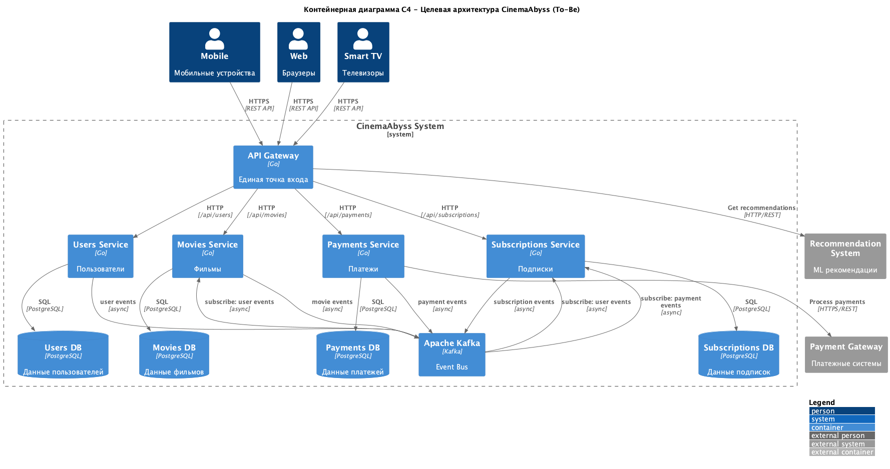
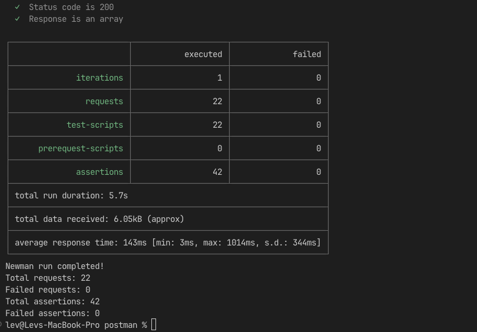
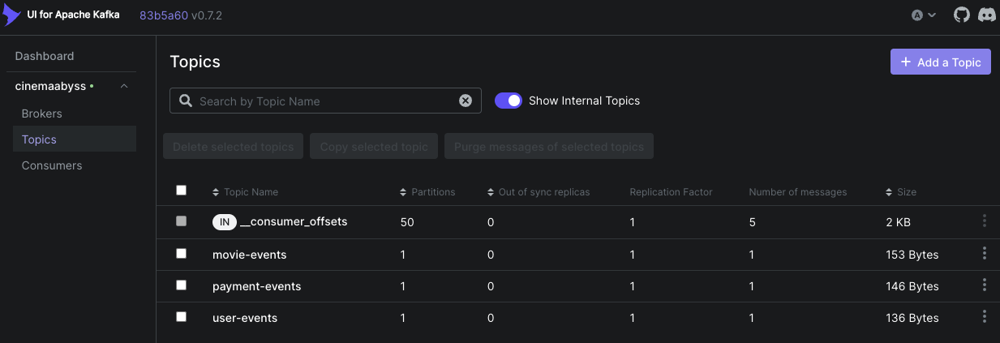

# Ответ на Задание 1

**Контейнерная диаграмма C4:** [CinemaAbyss_ToBe_Architecture.puml](architecture/CinemaAbyss_ToBe_Architecture.puml)



Разделил систему на 4 домена:

- Users - пользователи и профили
- Movies - каталог фильмов
- Payments - платежи
- Subscriptions - подписки

Каждый домен имеет свой сервис и БД. Все запросы идут через API Gateway. Для асинхронного взаимодействия используется Kafka. Внешние системы: рекомендации и платежный шлюз.

# Ответ на Задание 2

## Часть 1. Реализация прокси-сервиса

**Proxy Service (Strangler Fig pattern):**

- API Gateway на порту 8000 с маршрутизацией запросов
- Постепенная миграция трафика через `MOVIES_MIGRATION_PERCENT` (50% по умолчанию)
- Прозрачное проксирование к monolith и movies-service
- Health check endpoint: `/health`

**Тестирование:**

```bash
curl http://localhost:8000/api/movies  # Работает через proxy
```

## Часть 2. Реализация Kafka

**Events Service (MVP с Producer/Consumer):**

- Реальная интеграция с Kafka (библиотека `github.com/segmentio/kafka-go`)
- Producer/Consumer для топиков: `movie-events`, `user-events`, `payment-events`
- API endpoints:
  - `/api/events/health` - проверка здоровья
  - `/api/events/movie` - создание событий фильмов
  - `/api/events/user` - создание пользовательских событий
  - `/api/events/payment` - создание событий платежей
- Автосоздание топиков и consumer groups

**Результаты тестирования:**



**Все тесты зеленые:** 22/22 запроса успешно, 42/42 утверждения прошли

**Kafka топики с сообщениями:**



**Топики созданы автоматически:**

- `movie-events`: 1 сообщение (153 Bytes)
- `payment-events`: 1 сообщение (146 Bytes)
- `user-events`: 1 сообщение (136 Bytes)

**Архитектурные решения:**

- Использованы Bitnami образы Kafka/ZooKeeper для кроссплатформенности
- Реализован полный цикл: API → Producer → Kafka → Consumer → Логирование
- Events service сам создает и читает сообщения (MVP требование)

# Ответ на Задание 3

**CI/CD:** Доработал `docker-build-push.yml` для сборки proxy и events сервисов в GitHub Container Registry

**Kubernetes:** Создал манифесты `events-service.yaml` и `proxy-service.yaml`, настроил ingress для доступа к событиям

**Деплой по шагам 1-12:**

- Все 7 подов запущены
- API работает: `https://cinemaabyss.example.com/api/movies`
- Newman тесты: 22/22 успешны

**Скриншоты:**


# Ответ на Задание 4

**Helm charts:** Обновил `values.yaml` со своими образами, заполнил шаблоны `proxy-service.yaml` и `events-service.yaml`

**Деплой:** `helm install cinemaabyss src/kubernetes/helm --namespace cinemaabyss --create-namespace`

**Результат:**

- Все 7 подов запущены ✅
- `https://cinemaabyss.example.com/api/movies` работает ✅
- Postman тесты проходят ✅

**Скриншоты развертывания:**


